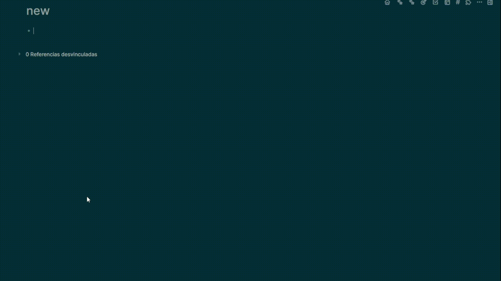
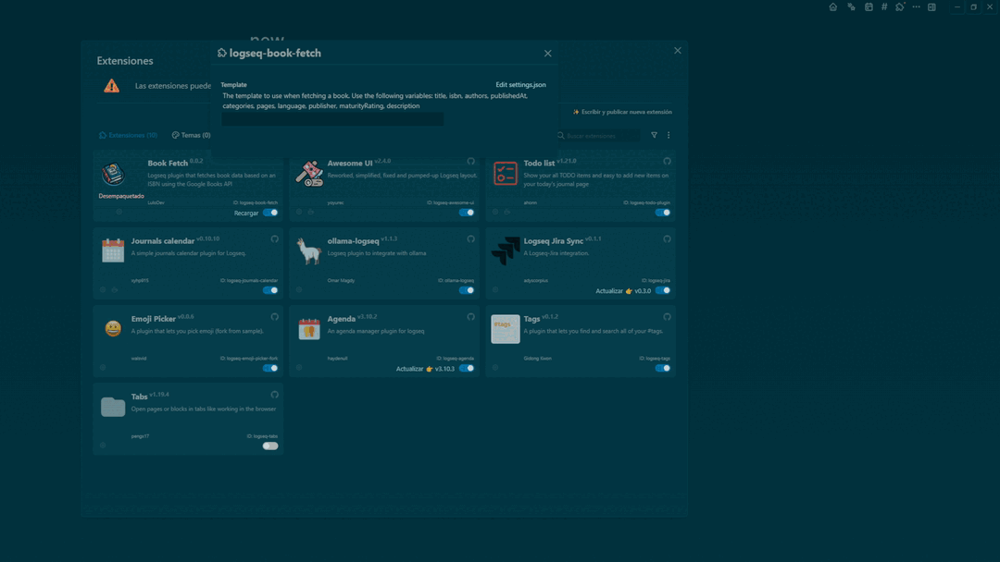
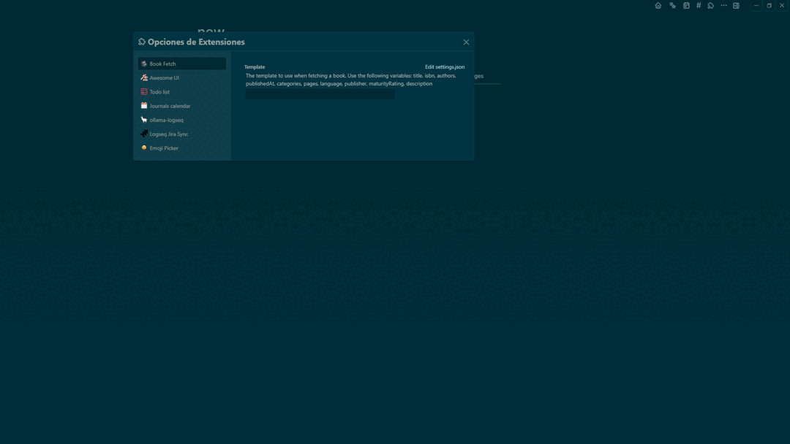

<a name="readme-top"></a>

<div align="center">
  
  [![Contributors][contributors-shield]][contributors-url]
  [![Forks][forks-shield]][forks-url]
  [![Stargazers][stars-shield]][stars-url]
  [![Issues][issues-shield]][issues-url]

  

# LOGSEQ-BOOK-FETCH

This is a Logseq plugin that fetches book data based on an ISBN using the Google Books API.

[Report error](https://github.com/LuloDev/logseq-book-fetch/issues) · [Suggest something](https://github.com/LuloDev/logseq-book-fetch/issues)

</div>

## Usage



1. Open Logseq.
2. Enter the ISBN of the book you want to fetch data for.
3. Use the slash command `/Book Fetch` in the editor.

The plugin will fetch the book data and insert it into the current block.

<p align="right">(<a href="#readme-top">Go Top</a>)</p>

## Features

- Fetch book data based on an ISBN using the Google Books API.
- Insert fetched book data into the current block in Logseq.
- Provide a slash command `/Book Fetch` for easy access to the plugin.
- Configure which data to insert into the current block.

## Availability Data

| Data            | Description                                |
| --------------- | ------------------------------------------ |
| Title           | The title of the book.                     |
| Author          | The author(s) of the book.                 |
| Publisher       | The publisher of the book.                 |
| Publication     | The publication date of the book.          |
| Description     | A brief description of the book.           |
| Categories      | The categories or genres of the book.      |
| Page Count      | The total number of pages in the book.     |
| Language        | The language in which the book is written. |
| Image           | The cover image of the book.               |
| ISBN            | The ISBN of the book.                      |
| Maturity Rating | The Maturity Rating of the book.           |

## Template Configuration

The template is used to format the fetched book data that is inserted into the current block in Logseq. You can customize the template to fit your needs.

The template is a string that contains various keys enclosed in double curly braces (`{{key}}`). Each key is replaced by the corresponding value from the book data. The available keys are:

- `thumbnail`: The URL of the book's thumbnail image.
- `title`: The title of the book.
- `isbn`: The ISBN of the book.
- `authors`: The authors of the book, separated by commas.
- `publishedAt`: The publication date of the book.
- `categories`: The categories or genres of the book, separated by commas.
- `pages`: The total number of pages in the book.
- `language`: The language in which the book is written.
- `publisher`: The publisher of the book.
- `maturityRating`: The maturity rating of the book.
- `description`: A brief description of the book.

You can use `\n` to insert a line break in the template. For example, the following template:

> **Note:** If you edit the content directly in the `settings.json` file of the Logseq plugin configurations, you should use `\\n` for line breaks. However, if you edit it through the Logseq app, you only need to use `\n`.

## Examples

Here are some examples of how you can use the template configuration:

### Example 1: Simple Template

```
{{title}} by {{authors}}
```


### Example 2: Detailed Template with Line Breaks

```
- Title: {{title}}\n- Authors: {{authors}}\n- ISBN: {{isbn}}\n- Published At: {{publishedAt}}\n- Categories: {{categories}}\n- Pages: {{pages}}\n- Language: {{language}}\n- Publisher: {{publisher}}\n- Maturity Rating: {{maturityRating}}\n- Description: {{description}}
```

> **Note:** If you edit the content directly in the `settings.json` file of the Logseq plugin configurations, you should use `\\n` for line breaks. However, if you edit it through the Logseq app, you only need to use `\n`.



### Example 3: Detailed Template table row

```
|  | {{title}} | {{isbn}} | {{authors}} | {{publishedAt}} | {{categories}} | {{pages}} |
```



<p align="right">(<a href="#readme-top">Go Top</a>)</p>

## Development

To build the project, run

```bash
pnpm run build
```

To start the development, run

```bash
pnpm run dev
```

<p align="right">(<a href="#readme-top">Go Top</a>)</p>

## Dependencies

- `@logseq/libs`
- `axios`

## Author

LuloDev

## LICENSE

[MIT License](LICENSE)

<p align="right">(<a href="#readme-top">Go Top</a>)</p>

[contributors-shield]: https://img.shields.io/github/contributors/LuloDev/logseq-book-fetch.svg?style=for-the-badge
[contributors-url]: https://github.com/LuloDev/logseq-book-fetch/graphs/contributors
[forks-shield]: https://img.shields.io/github/forks/LuloDev/logseq-book-fetch.svg?style=for-the-badge
[forks-url]: https://github.com/LuloDev/logseq-book-fetch/network/members
[stars-shield]: https://img.shields.io/github/stars/LuloDev/logseq-book-fetch.svg?style=for-the-badge
[stars-url]: https://github.com/LuloDev/logseq-book-fetch/stargazers
[issues-shield]: https://img.shields.io/github/issues/LuloDev/logseq-book-fetch.svg?style=for-the-badge
[issues-url]: https://github.com/LuloDev/l`ogseq-book-fetch/issues
